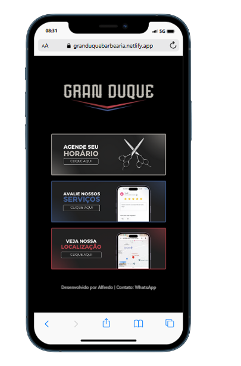

  
    <h1>Linfy Pro - Gran Duque Barbearia</h1>
    
Linkfy Pro é a solução definitiva para centralizar todos os seus links importantes em um só lugar. Feito usando HTML e CSS.

    

      
    

  

  
  

   <h1>Características</h1>
    
Esta página web foi desenvolvida utilizando tecnologias simples:

    <ul>
      <li>HTML: uma linguagem de marcação.</li>
      <li>CSS: uma linguagem de estilização.</li>
    </ul>
  

  
  

   <h1>Link para acesso</h1>
   Site: https://alfredoneeto.github.io/maratona-explorer-2/
    
  

